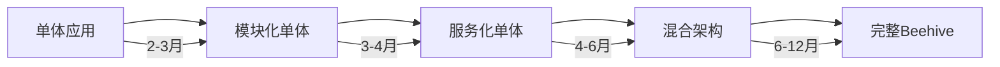

# Beehive 架构 vs 分层架构对比分析

## 一、架构模式概述

### Beehive（蜂巢）架构
Beehive 架构是一种受自然界蜂巢结构启发的分布式系统架构模式，主要特征：

- **六边形单元（Hexagonal Cells）**：每个服务作为独立的六边形单元，拥有标准化的接口
- **去中心化通信**：单元间通过消息传递直接通信，无需中央协调器
- **自组织能力**：新单元可以动态加入，系统自动发现和路由
- **容错性强**：单个单元失效不影响整体，具有自愈能力
- **弹性扩展**：可根据负载动态增减单元数量

### 分层架构（Layered Architecture）
传统的 N 层架构模式，通过垂直分层实现关注点分离：

- **表示层**：用户界面和交互逻辑
- **业务逻辑层**：核心业务规则和流程
- **数据访问层**：数据持久化和查询
- **横切关注点**：认证、日志、缓存等

## 二、架构对比分析

### 1. 分层架构特征分析

```
┌─────────────────────────────────────┐
│       Presentation Layer            │
│         (React + WebSocket)         │
├─────────────────────────────────────┤
│         API Gateway Layer           │
│    (FastAPI + Auth + Rate Limit)   │
├─────────────────────────────────────┤
│       Business Logic Layer          │
│  ┌──────────┬──────────┬─────────┐ │
│  │ Workflow │   RAG    │ Plugin  │ │
│  │ Service  │ Service  │ Service │ │
│  └──────────┴──────────┴─────────┘ │
├─────────────────────────────────────┤
│      Data Access Layer              │
│  ┌──────────┬──────────┬─────────┐ │
│  │PostgreSQL│  Redis   │pgvector │ │
│  └──────────┴──────────┴─────────┘ │
└─────────────────────────────────────┘
```

**优势**：
- ✅ **开发效率高**：清晰的层次结构，易于理解和维护
- ✅ **技术栈统一**：减少技术异构性，降低学习成本
- ✅ **事务管理简单**：同一进程内的事务处理更容易
- ✅ **调试方便**：单体应用的调试和问题定位相对简单
- ✅ **部署简单**：单一部署单元，DevOps 流程简化

**劣势**：
- ❌ **扩展性受限**：只能整体扩展，无法针对热点模块独立扩展
- ❌ **技术锁定**：难以在不同层使用不同的技术栈
- ❌ **故障传播**：一个模块的问题可能影响整个系统
- ❌ **部署风险**：任何改动都需要重新部署整个应用

### 2. Beehive 架构在 Agent 平台的应用

```
        ┌─────────┐     ┌─────────┐     ┌─────────┐
        │Workflow │     │  RAG    │     │ Plugin  │
        │ Cell-1  │     │ Cell-1  │     │ Cell-1  │
        └────┬────┘     └────┬────┘     └────┬────┘
             │               │               │
    ┌────────┴───────────────┴───────────────┴────────┐
    │                 Message Bus                      │
    │              (NATS/RabbitMQ)                    │
    └────────┬───────────────┬───────────────┬────────┘
             │               │               │
        ┌────┴────┐     ┌────┴────┐     ┌────┴────┐
        │Workflow │     │  RAG    │     │  LLM    │
        │ Cell-2  │     │ Cell-2  │     │ Router  │
        └─────────┘     └─────────┘     └─────────┘

每个 Cell 的内部结构：
┌─────────────────────────┐
│      Cell Core          │
├─────────────────────────┤
│  ┌─────┐ ┌─────┐      │
│  │ API │ │Event│      │
│  │Port │ │Port │      │
│  └──┬──┘ └──┬──┘      │
│     │       │          │
│  ┌──┴───────┴───┐     │
│  │Business Logic│     │
│  └──────┬───────┘     │
│         │              │
│  ┌──────┴───────┐     │
│  │  Local Store │     │
│  └──────────────┘     │
└─────────────────────────┘
```

**优势**：
- ✅ **独立部署**：每个 Cell 可以独立开发、测试和部署
- ✅ **技术异构**：不同 Cell 可使用最适合的技术栈
- ✅ **弹性伸缩**：根据负载独立扩展特定 Cell
- ✅ **故障隔离**：Cell 间通过消息通信，故障不会直接传播
- ✅ **团队自治**：不同团队可以独立负责不同 Cell

**劣势**：
- ❌ **复杂度高**：分布式系统固有的复杂性
- ❌ **网络开销**：Cell 间通信需要网络调用
- ❌ **数据一致性**：分布式事务处理困难
- ❌ **运维成本**：需要复杂的监控和追踪系统
- ❌ **调试困难**：跨服务调试和问题定位复杂

## 三、具体实现方案对比

### 方案一：优化的分层架构（MVP 推荐）

```python
# 项目结构 - 模块化单体
morphix/
├── backend/
│   ├── app/
│   │   ├── api/                    # API 端点
│   │   │   ├── v1/
│   │   │   │   ├── workflows.py
│   │   │   │   ├── rag.py
│   │   │   │   └── plugins.py
│   │   │   └── deps.py            # 依赖注入
│   │   ├── services/              # 业务服务层
│   │   │   ├── interfaces/        # 服务接口定义
│   │   │   │   ├── base.py
│   │   │   │   ├── workflow.py
│   │   │   │   └── rag.py
│   │   │   ├── workflow/          # 工作流服务实现
│   │   │   │   ├── service.py
│   │   │   │   ├── executor.py
│   │   │   │   └── state_manager.py
│   │   │   ├── rag/              # RAG 服务实现
│   │   │   │   ├── service.py
│   │   │   │   ├── vectorstore.py
│   │   │   │   └── retriever.py
│   │   │   └── registry.py       # 服务注册表
│   │   ├── core/                  # 核心组件
│   │   │   ├── config.py
│   │   │   ├── security.py
│   │   │   └── exceptions.py
│   │   └── infrastructure/       # 基础设施
│   │       ├── database.py
│   │       ├── cache.py
│   │       └── message_queue.py
│   └── tests/                     # 测试
```

**关键设计模式：**
```python
# 1. 依赖倒置原则 - 接口定义
from abc import ABC, abstractmethod
from typing import Protocol, Dict, Any, List

class WorkflowServiceProtocol(Protocol):
    """工作流服务协议"""
    async def create_workflow(self, definition: Dict[str, Any]) -> str: ...
    async def execute_workflow(self, workflow_id: str, inputs: Dict[str, Any]) -> Dict[str, Any]: ...
    async def get_execution_status(self, execution_id: str) -> Dict[str, Any]: ...

class RAGServiceProtocol(Protocol):
    """RAG 服务协议"""
    async def index_documents(self, documents: List[Dict[str, Any]]) -> None: ...
    async def search(self, query: str, top_k: int = 10) -> List[Dict[str, Any]]: ...
    async def hybrid_search(self, query: str, filters: Dict[str, Any]) -> List[Dict[str, Any]]: ...

# 2. 服务注册器 - 便于未来迁移
class ServiceRegistry:
    """服务注册表，支持本地和远程服务"""
    _instance = None
    _services: Dict[str, Any] = {}
    
    def __new__(cls):
        if cls._instance is None:
            cls._instance = super().__new__(cls)
        return cls._instance
    
    def register(self, name: str, service: Any, service_type: str = "local"):
        """注册服务"""
        self._services[name] = {
            "instance": service,
            "type": service_type,
            "health_check": getattr(service, "health_check", None)
        }
    
    def get(self, name: str) -> Any:
        """获取服务实例"""
        service_info = self._services.get(name)
        if not service_info:
            raise ServiceNotFoundError(f"Service {name} not found")
        
        # 未来可在此处添加远程服务代理逻辑
        if service_info["type"] == "remote":
            return self._create_remote_proxy(name, service_info)
        
        return service_info["instance"]
    
    def _create_remote_proxy(self, name: str, service_info: Dict[str, Any]):
        """创建远程服务代理（为 Beehive 预留）"""
        # TODO: 实现 gRPC/HTTP 客户端代理
        pass

# 3. 实现示例
class WorkflowService:
    """工作流服务实现"""
    
    def __init__(self, 
                 graph_engine: LangGraphEngine,
                 rag_service: RAGServiceProtocol,
                 cache: CacheProtocol):
        self.graph_engine = graph_engine
        self.rag_service = rag_service
        self.cache = cache
    
    async def execute_workflow(self, workflow_id: str, inputs: Dict[str, Any]) -> Dict[str, Any]:
        # 检查缓存
        cache_key = f"workflow:{workflow_id}:{hash(str(inputs))}"
        cached_result = await self.cache.get(cache_key)
        if cached_result:
            return cached_result
        
        # 构建执行上下文
        context = ExecutionContext(
            workflow_id=workflow_id,
            inputs=inputs,
            services={
                "rag": self.rag_service,
                "llm": self.llm_service
            }
        )
        
        # 执行工作流
        result = await self.graph_engine.execute(context)
        
        # 缓存结果
        await self.cache.set(cache_key, result, ttl=3600)
        
        return result
```

### 方案二：Beehive 微服务架构（长期演进）

```yaml
# 项目结构 - 蜂巢架构
morphix/
├── cells/                          # 独立服务单元
│   ├── workflow-cell/
│   │   ├── src/
│   │   │   ├── api/               # REST/gRPC API
│   │   │   ├── core/              # 业务逻辑
│   │   │   ├── adapters/          # 外部服务适配器
│   │   │   └── events/            # 事件处理
│   │   ├── tests/
│   │   ├── Dockerfile
│   │   ├── requirements.txt
│   │   └── cell.yaml              # Cell 配置
│   │
│   ├── rag-cell/
│   │   ├── src/
│   │   ├── Dockerfile
│   │   └── cell.yaml
│   │
│   └── llm-router-cell/
│       ├── src/
│       ├── Dockerfile
│       └── cell.yaml
│
├── shared/                        # 共享组件
│   ├── protocols/                 # 通信协议定义
│   │   ├── grpc/
│   │   │   └── morphix.proto
│   │   └── events/
│   │       └── schemas.py
│   ├── sdk/                       # 客户端 SDK
│   │   └── python/
│   │       └── morphix_sdk/
│   └── contracts/                 # 服务契约
│
├── infrastructure/               # 基础设施配置
│   ├── kubernetes/              # K8s 部署文件
│   │   ├── base/
│   │   └── overlays/
│   ├── terraform/               # 基础设施即代码
│   └── monitoring/              # 监控配置
│
└── platform/                    # 平台服务
    ├── api-gateway/            # API 网关
    ├── service-mesh/           # 服务网格配置
    └── message-bus/            # 消息总线
```

**Cell 实现示例：**
```python
# cells/workflow-cell/src/core/cell.py
from abc import ABC, abstractmethod
from typing import Dict, Any, Optional
import asyncio
from datetime import datetime

class BaseCell(ABC):
    """蜂巢单元基类"""
    
    def __init__(self, cell_config: CellConfig):
        self.id = cell_config.id
        self.name = cell_config.name
        self.version = cell_config.version
        self.neighbors = {}  # 邻居 Cell 注册表
        self.message_bus = None
        self.health_status = HealthStatus.STARTING
        
    async def initialize(self):
        """初始化 Cell"""
        # 1. 连接消息总线
        self.message_bus = await MessageBus.connect(self.config.message_bus_url)
        
        # 2. 注册到服务发现
        await self.register_to_discovery()
        
        # 3. 订阅相关事件
        await self.subscribe_events()
        
        # 4. 启动健康检查
        asyncio.create_task(self.health_check_loop())
        
        self.health_status = HealthStatus.HEALTHY
    
    @abstractmethod
    async def handle_request(self, request: CellRequest) -> CellResponse:
        """处理同步请求"""
        pass
    
    @abstractmethod
    async def handle_event(self, event: CellEvent) -> None:
        """处理异步事件"""
        pass
    
    async def call_neighbor(self, 
                           neighbor_id: str, 
                           request: Dict[str, Any],
                           timeout: Optional[float] = 30.0) -> Dict[str, Any]:
        """调用邻居 Cell"""
        neighbor = self.neighbors.get(neighbor_id)
        if not neighbor:
            # 动态发现邻居
            neighbor = await self.discover_neighbor(neighbor_id)
            self.neighbors[neighbor_id] = neighbor
        
        # 支持多种通信方式
        if neighbor.protocol == "grpc":
            return await self._call_grpc(neighbor, request, timeout)
        elif neighbor.protocol == "http":
            return await self._call_http(neighbor, request, timeout)
        else:
            return await self._call_via_message_bus(neighbor, request, timeout)

# cells/workflow-cell/src/core/workflow_cell.py
class WorkflowCell(BaseCell):
    """工作流执行 Cell"""
    
    def __init__(self, config: CellConfig):
        super().__init__(config)
        self.langgraph_engine = None
        self.execution_store = None
        
    async def initialize(self):
        await super().initialize()
        
        # 初始化 LangGraph 引擎
        self.langgraph_engine = LangGraphEngine(
            checkpoint_store=PostgresCheckpointer(self.config.db_url)
        )
        
        # 初始化执行存储
        self.execution_store = ExecutionStore(self.config.db_url)
    
    async def handle_request(self, request: CellRequest) -> CellResponse:
        """处理工作流执行请求"""
        if request.action == "execute_workflow":
            return await self._execute_workflow(request)
        elif request.action == "get_status":
            return await self._get_execution_status(request)
        else:
            raise UnsupportedActionError(f"Action {request.action} not supported")
    
    async def _execute_workflow(self, request: CellRequest) -> CellResponse:
        workflow_id = request.data["workflow_id"]
        inputs = request.data["inputs"]
        
        # 创建执行记录
        execution = await self.execution_store.create(
            workflow_id=workflow_id,
            inputs=inputs,
            tenant_id=request.tenant_id
        )
        
        # 异步执行工作流
        asyncio.create_task(self._run_workflow(execution))
        
        return CellResponse(
            success=True,
            data={"execution_id": execution.id, "status": "started"}
        )
    
    async def _run_workflow(self, execution: WorkflowExecution):
        try:
            # 获取工作流定义
            workflow_def = await self._get_workflow_definition(execution.workflow_id)
            
            # 构建执行图
            graph = self.langgraph_engine.build_graph(workflow_def)
            
            # 执行过程中可能需要调用其他 Cell
            async for event in graph.astream(execution.inputs):
                if event.type == "need_rag":
                    # 调用 RAG Cell
                    rag_result = await self.call_neighbor(
                        "rag-cell",
                        {"action": "search", "query": event.data["query"]}
                    )
                    event.data["rag_result"] = rag_result
                
                # 更新执行状态
                await self.execution_store.update_status(
                    execution.id, 
                    event.data
                )
                
                # 发布执行事件
                await self.publish_event(WorkflowProgressEvent(
                    execution_id=execution.id,
                    progress=event.data
                ))
            
            # 标记完成
            await self.execution_store.complete(execution.id)
            
        except Exception as e:
            await self.execution_store.fail(execution.id, str(e))
            await self.publish_event(WorkflowFailedEvent(
                execution_id=execution.id,
                error=str(e)
            ))
```

**Cell 间通信协议：**
```protobuf
// shared/protocols/grpc/morphix.proto
syntax = "proto3";

package morphix;

service CellService {
    rpc Call(CellRequest) returns (CellResponse);
    rpc Stream(CellRequest) returns (stream CellEvent);
    rpc HealthCheck(Empty) returns (HealthStatus);
}

message CellRequest {
    string id = 1;
    string action = 2;
    google.protobuf.Any data = 3;
    map<string, string> metadata = 4;
    string tenant_id = 5;
}

message CellResponse {
    bool success = 1;
    google.protobuf.Any data = 2;
    string error = 3;
}

message CellEvent {
    string type = 1;
    google.protobuf.Any payload = 2;
    int64 timestamp = 3;
}
```

## 四、基于 Agent 平台特性的架构选择

### 架构决策矩阵

| 考虑因素 | 分层架构 | Beehive 架构 | Agent 平台需求匹配度 |
|---------|---------|--------------|-------------------|
| **开发复杂度** | 低 ⭐⭐ | 高 ⭐⭐⭐⭐⭐ | MVP 阶段需要快速迭代 |
| **团队规模要求** | 2-5人 | 10+人 | 当前团队规模有限 |
| **上线时间** | 2-3个月 | 6-8个月 | 需要快速验证市场 |
| **扩展性** | 中等 ⭐⭐⭐ | 极高 ⭐⭐⭐⭐⭐ | 未来需要高扩展性 |
| **运维成本** | 低 ⭐⭐ | 高 ⭐⭐⭐⭐ | 初期控制成本 |
| **性能优化空间** | 有限 | 灵活 | Agent 执行需要高性能 |
| **故障隔离** | 差 ⭐ | 优秀 ⭐⭐⭐⭐⭐ | 企业级需要高可用 |
| **技术债务** | 随时间增加 | 复杂度债务 | 需要平衡 |

### 阶段性架构演进策略

#### Phase 1: MVP 阶段（0-6个月）
**采用优化的分层架构**

```python
# 核心设计原则
1. 服务接口化 - 所有服务必须通过接口定义
2. 依赖注入 - 便于测试和未来替换
3. 事件驱动 - 预埋异步通信机制
4. 模块边界清晰 - 为未来拆分做准备

# 技术选型
- 单体应用：FastAPI + PostgreSQL + Redis
- 部署方式：Docker Compose / 单机 K8s
- 监控：Prometheus + Grafana
- 日志：ELK Stack

# 关键指标
- 日活跃工作流：< 1,000
- 并发用户：< 100
- 响应时间：< 500ms
```

#### Phase 2: 增长阶段（6-12个月）
**服务化改造**

```python
# 拆分策略
1. 识别瓶颈服务
   - RAG 服务（计算密集）
   - LLM 路由（需要独立扩展）
   - 文档处理（IO 密集）

2. 逐步抽离
   - 保持核心业务在单体中
   - 将计算密集型服务拆分
   - 引入消息队列解耦

# 技术升级
- 引入 API Gateway (Kong/Traefik)
- 消息队列：RabbitMQ/NATS
- 服务发现：Consul/Etcd
- 分布式追踪：Jaeger

# 关键指标
- 日活跃工作流：1,000 - 10,000
- 并发用户：100 - 1,000
- 响应时间：< 200ms
```

#### Phase 3: 成熟阶段（12个月+）
**完整 Beehive 架构**

```python
# 全面微服务化
1. 所有核心功能独立为 Cell
2. 引入服务网格 (Istio)
3. 多集群部署
4. 全球化部署考虑

# 技术栈
- 容器编排：Kubernetes
- 服务网格：Istio/Linkerd
- 消息总线：Kafka/Pulsar
- 分布式存储：Cassandra/TiDB

# 关键指标
- 日活跃工作流：> 10,000
- 并发用户：> 1,000
- 响应时间：< 100ms (P99)
- 可用性：99.95%
```

## 五、渐进式架构迁移方案

### 迁移路线图



### 具体迁移步骤

#### Step 1: 模块化改造（保持单体部署）
```python
# 1. 抽象服务接口
from typing import Protocol, runtime_checkable

@runtime_checkable
class ServiceProtocol(Protocol):
    """所有服务的基础协议"""
    async def health_check(self) -> Dict[str, Any]: ...
    async def shutdown(self) -> None: ...

# 2. 实现服务注册器
class ServiceContainer:
    """服务容器，支持依赖注入和生命周期管理"""
    
    def __init__(self):
        self._services: Dict[str, Any] = {}
        self._factories: Dict[str, Callable] = {}
        self._singletons: Dict[str, Any] = {}
    
    def register_singleton(self, name: str, factory: Callable):
        """注册单例服务"""
        self._factories[name] = factory
    
    def register_transient(self, name: str, factory: Callable):
        """注册瞬态服务"""
        self._factories[name] = factory
    
    async def get[T](self, name: str, interface: Type[T]) -> T:
        """获取服务实例"""
        if name in self._singletons:
            return self._singletons[name]
        
        factory = self._factories.get(name)
        if not factory:
            raise ServiceNotFoundError(f"Service {name} not registered")
        
        instance = await factory() if asyncio.iscoroutinefunction(factory) else factory()
        
        # 类型检查
        if not isinstance(instance, interface):
            raise TypeError(f"Service {name} does not implement {interface}")
        
        # 缓存单例
        if name in self._factories and name not in self._singletons:
            self._singletons[name] = instance
        
        return instance

# 3. 模块化配置
@dataclass
class ModuleConfig:
    """模块配置"""
    name: str
    enabled: bool = True
    dependencies: List[str] = field(default_factory=list)
    settings: Dict[str, Any] = field(default_factory=dict)

class ModuleManager:
    """模块管理器"""
    
    def __init__(self, container: ServiceContainer):
        self.container = container
        self.modules: Dict[str, Module] = {}
    
    async def load_module(self, config: ModuleConfig):
        """加载模块"""
        if not config.enabled:
            return
        
        # 检查依赖
        for dep in config.dependencies:
            if dep not in self.modules:
                raise ModuleDependencyError(f"Module {config.name} requires {dep}")
        
        # 动态加载模块
        module_class = self._load_module_class(config.name)
        module = module_class(config, self.container)
        
        # 初始化模块
        await module.initialize()
        self.modules[config.name] = module
```

#### Step 2: 引入消息总线（事件驱动）
```python
# 1. 事件总线抽象
class EventBus(Protocol):
    """事件总线协议"""
    async def publish(self, topic: str, event: Event) -> None: ...
    async def subscribe(self, topic: str, handler: EventHandler) -> None: ...
    async def unsubscribe(self, topic: str, handler: EventHandler) -> None: ...

# 2. 本地实现（单体内）
class LocalEventBus:
    """本地事件总线实现"""
    
    def __init__(self):
        self._handlers: Dict[str, List[EventHandler]] = defaultdict(list)
    
    async def publish(self, topic: str, event: Event) -> None:
        handlers = self._handlers.get(topic, [])
        
        # 并发执行所有处理器
        tasks = [handler(event) for handler in handlers]
        await asyncio.gather(*tasks, return_exceptions=True)

# 3. 分布式实现（为迁移准备）
class DistributedEventBus:
    """分布式事件总线实现"""
    
    def __init__(self, broker_url: str):
        self.broker_url = broker_url
        self._connection = None
        self._local_handlers = defaultdict(list)
    
    async def publish(self, topic: str, event: Event) -> None:
        # 本地处理
        await self._publish_local(topic, event)
        
        # 远程发布
        if self._connection:
            await self._publish_remote(topic, event)
    
    async def _publish_remote(self, topic: str, event: Event):
        """发布到远程消息队列"""
        message = {
            "id": str(uuid.uuid4()),
            "topic": topic,
            "timestamp": datetime.utcnow().isoformat(),
            "payload": event.dict(),
            "metadata": {
                "source": self.node_id,
                "version": "1.0"
            }
        }
        await self._connection.publish(topic, json.dumps(message))
```

#### Step 3: 服务拆分策略
```python
# 1. 识别拆分边界
class ServiceBoundaryAnalyzer:
    """服务边界分析器"""
    
    def analyze_dependencies(self, codebase: Path) -> Dict[str, List[str]]:
        """分析代码依赖关系"""
        # 使用 AST 分析导入关系
        # 识别高内聚、低耦合的模块
        pass
    
    def calculate_metrics(self, module: str) -> ServiceMetrics:
        """计算服务指标"""
        return ServiceMetrics(
            coupling_score=self._calculate_coupling(module),
            cohesion_score=self._calculate_cohesion(module),
            complexity=self._calculate_complexity(module),
            data_affinity=self._analyze_data_usage(module)
        )

# 2. 渐进式服务抽取
class ServiceExtractor:
    """服务抽取器"""
    
    async def extract_service(self, 
                            module_name: str,
                            target_type: Literal["local", "remote"]) -> ExtractedService:
        """抽取服务"""
        if target_type == "local":
            # 进程内服务（第一步）
            return await self._extract_local_service(module_name)
        else:
            # 独立部署服务（第二步）
            return await self._extract_remote_service(module_name)
    
    async def _extract_local_service(self, module_name: str) -> LocalService:
        """抽取为本地服务"""
        # 1. 创建服务接口
        interface = self._generate_interface(module_name)
        
        # 2. 实现服务适配器
        adapter = self._create_adapter(module_name, interface)
        
        # 3. 更新依赖注入
        await self._update_container(module_name, adapter)
        
        return LocalService(interface, adapter)
```

#### Step 4: 监控和回滚机制
```python
# 1. 架构健康度监控
class ArchitectureHealthMonitor:
    """架构健康监控"""
    
    def __init__(self):
        self.metrics = {
            "service_latency": {},
            "error_rates": {},
            "dependency_health": {},
            "resource_usage": {}
        }
    
    async def check_migration_health(self) -> MigrationHealth:
        """检查迁移健康度"""
        return MigrationHealth(
            service_health=await self._check_service_health(),
            performance_impact=await self._measure_performance_impact(),
            error_increase=await self._calculate_error_increase(),
            rollback_ready=await self._check_rollback_readiness()
        )

# 2. 特性开关
class FeatureToggle:
    """特性开关管理"""
    
    def __init__(self, config_source: ConfigSource):
        self.config_source = config_source
        self.cache = {}
    
    def is_enabled(self, feature: str, context: Dict[str, Any] = None) -> bool:
        """检查特性是否启用"""
        # 支持按租户、用户、百分比等维度控制
        config = self.config_source.get_feature_config(feature)
        
        if config.rollout_percentage:
            # 灰度发布
            return self._check_rollout(feature, context, config.rollout_percentage)
        
        return config.enabled

# 3. 回滚机制
class RollbackManager:
    """回滚管理器"""
    
    async def create_checkpoint(self, name: str):
        """创建检查点"""
        checkpoint = Checkpoint(
            name=name,
            timestamp=datetime.utcnow(),
            service_versions=await self._get_service_versions(),
            configuration=await self._dump_configuration(),
            database_snapshot=await self._create_db_snapshot()
        )
        await self._save_checkpoint(checkpoint)
    
    async def rollback_to(self, checkpoint_name: str):
        """回滚到检查点"""
        checkpoint = await self._load_checkpoint(checkpoint_name)
        
        # 1. 停止流量
        await self._enable_maintenance_mode()
        
        # 2. 回滚服务
        await self._rollback_services(checkpoint.service_versions)
        
        # 3. 恢复配置
        await self._restore_configuration(checkpoint.configuration)
        
        # 4. 恢复数据（如需要）
        if self._needs_data_rollback(checkpoint):
            await self._restore_database(checkpoint.database_snapshot)
        
        # 5. 恢复流量
        await self._disable_maintenance_mode()
```

## 六、架构决策建议

### 推荐方案：渐进式架构演进

基于 Morphix Agent 平台的特点和发展阶段，推荐采用**"先分层、后蜂巢"的渐进式架构演进策略**：

#### 决策依据

1. **业务特征**
   - 初期用户规模有限，不需要复杂的分布式架构
   - Agent 工作流执行是核心功能，需要快速迭代
   - 知识库和插件系统需要逐步完善

2. **技术约束**
   - 团队规模较小（2-5人）
   - 需要在 3-4 个月内推出 MVP
   - 运维能力有限，需要控制复杂度

3. **未来需求**
   - 支持大规模多租户（100+ 企业客户）
   - 插件生态系统需要独立演进
   - 全球化部署和高可用要求

### 架构演进时间线

```
┌─────────────┐    ┌─────────────┐    ┌─────────────┐    ┌─────────────┐
│   Month     │    │   Month     │    │   Month     │    │   Month     │
│    1-3      │───▶│    4-6      │───▶│    7-12     │───▶│    12+      │
│             │    │             │    │             │    │             │
│  分层架构   │    │  模块化     │    │  混合架构   │    │  Beehive    │
│    MVP      │    │  优化       │    │  过渡期     │    │  完整实现   │
└─────────────┘    └─────────────┘    └─────────────┘    └─────────────┘
     ↓                   ↓                   ↓                   ↓
  快速上线          性能优化           部分拆分           全面微服务
  验证市场          提升质量           独立扩展           生态繁荣
```

### 关键成功因素

#### 1. 技术准备
- ✅ **接口先行**：从第一天开始就使用接口编程
- ✅ **事件驱动**：预埋事件机制，便于后期解耦
- ✅ **配置外化**：所有配置支持动态修改
- ✅ **监控完善**：从单体开始就建立完整监控

#### 2. 团队准备
- ✅ **知识储备**：团队成员学习分布式系统知识
- ✅ **工程实践**：建立 CI/CD、自动化测试等
- ✅ **文档规范**：架构决策记录（ADR）
- ✅ **代码审查**：确保架构一致性

#### 3. 业务对齐
- ✅ **分阶段目标**：每个阶段有明确的业务价值
- ✅ **风险控制**：每次架构改动都有回滚方案
- ✅ **成本效益**：架构复杂度与业务规模匹配
- ✅ **用户体验**：架构演进对用户透明

### 风险缓解策略

| 风险类型 | 缓解措施 |
|---------|---------|
| **技术债务累积** | 每个 Sprint 预留 20% 时间处理技术债务 |
| **架构腐化** | 定期架构评审，使用架构适应度函数 |
| **迁移失败** | 灰度发布 + 特性开关 + 快速回滚机制 |
| **性能退化** | 建立性能基线，持续性能测试 |
| **团队抵触** | 渐进式改变，提供培训和支持 |

### 投资回报分析

```python
# ROI 计算模型
def calculate_roi(architecture_type: str, timeline_months: int) -> Dict[str, float]:
    """计算架构投资回报率"""
    
    if architecture_type == "layered":
        # 分层架构
        development_cost = 100_000  # 低开发成本
        maintenance_cost = 20_000 * timeline_months  # 逐月增加
        scalability_limit = 1000  # 用户上限
        
    elif architecture_type == "beehive":
        # Beehive 架构
        development_cost = 300_000  # 高开发成本
        maintenance_cost = 10_000 * timeline_months  # 维护成本降低
        scalability_limit = 100_000  # 几乎无上限
    
    # 收益计算
    user_growth = calculate_user_growth(timeline_months)
    revenue = calculate_revenue(user_growth, scalability_limit)
    
    total_cost = development_cost + maintenance_cost
    roi = (revenue - total_cost) / total_cost * 100
    
    return {
        "total_cost": total_cost,
        "revenue": revenue,
        "roi_percentage": roi,
        "break_even_month": calculate_break_even(total_cost, revenue)
    }

# 预期结果
# - 分层架构：6个月内 ROI 为正
# - Beehive 架构：12-18个月 ROI 为正，但长期收益更高
```

## 七、总结与建议

### 核心建议

1. **立即行动**（第1-3个月）
   - 使用优化的分层架构快速构建 MVP
   - 严格遵循 SOLID 原则和 DDD 设计
   - 建立完整的测试和监控体系

2. **持续优化**（第4-6个月）
   - 根据实际负载识别性能瓶颈
   - 逐步引入缓存、消息队列等中间件
   - 开始模块化改造，为拆分做准备

3. **适时演进**（第7-12个月）
   - 当日活跃工作流超过 5,000 时考虑拆分
   - 优先拆分无状态、计算密集型服务
   - 保持核心业务逻辑的稳定性

4. **全面转型**（12个月后）
   - 根据业务发展决定是否全面 Beehive 化
   - 如果插件生态蓬勃发展，优先考虑插件系统独立
   - 始终以业务价值为导向

### 最终建议

**Beehive 架构在长期看来确实更有优势**，特别是对于需要高度扩展性和插件生态的 Agent 平台。但是，**过早采用会带来不必要的复杂性和成本**。

推荐采用**渐进式演进策略**：
- 短期（MVP）：优化的分层架构
- 中期（增长）：服务化改造
- 长期（成熟）：Beehive 微服务

这样既能快速响应市场，又为未来发展预留了充分的架构演进空间。记住：**架构是演进的，不是设计出来的**。